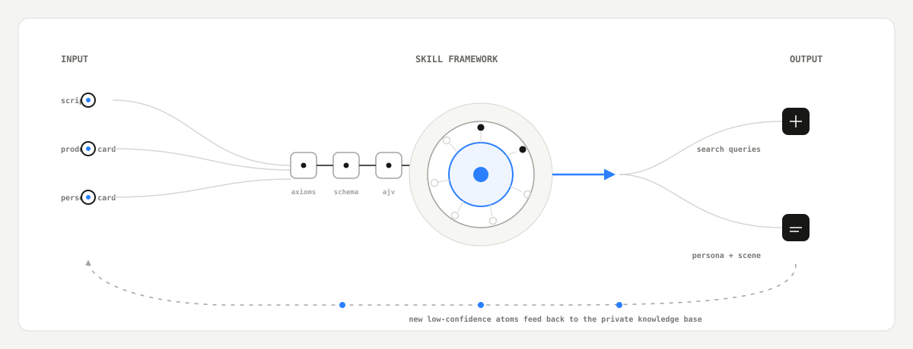

<h1 align="center">100x-skill-tiktok</h1>

<p align="center">
  <strong>把爆款方法论拆成可验证的 skill，框架公开，数据私有。</strong>
</p>

<p align="center">
  面向 TikTok / UGC 内容生产的 Claude Code / Codex / WorkBuddy(CodeBuddy) agent skill 合集：脚本分段、人物与场景设定、取材关键词、提示词编排，每条判据都能跑脚本验证，不是散文式方法论。
</p>

<p align="center">
  
</p>

<p align="center">
  
  
  
  
</p>

## 100x-skill-tiktok 是什么

这个仓库不是一份方法论文档合集。每个 skill 的判据（`axioms.md`）都配一个真实可运行的校验脚本（`scripts/validate.js`），能跑 `node scripts/validate.js --selftest` 当场验证——不是"逻辑已经想清楚"这种没有代码支撑的口头承诺。

仓库是三层架构里的第 2 层，通用能力件：

```
第1层 · 私有数据底座        （语料、知识原子，不进这个仓）
        ↓ requires_data 声明引用，不复制内容
第2层 · 100x-skill-tiktok   ← 本仓 · 框架公开
        ↓ registry 钉版本
第3层 · 产品项目            （实际业务落地）
```

> SKILL.md 是框架，atoms 是数据。前者公开，后者收费。

| 核心差异 | 这个仓库的处理方式 |
|---|---|
| 判据可验证性 | 每条公理必须能写成脚本判据；JSON Schema 表达不了的跨条目/跨字段约束（引用完整性、证据子串、5A覆盖率等）额外配手写校验，两层职责分开、都能真实执行 |
| 结构层校验 | 统一用 `ajv` 编译执行 `schema.json`（required/additionalProperties/enum/pattern），不用手写代码重新实现 JSON Schema 已经能做的事——历史上手写实现漏掉过 `additionalProperties` 检查，换 ajv 后才真被堵住 |
| 数据边界 | `evals/` 只放合成样例，真实客户语料/账号名/产品名一律不进仓；`requires_data` 只声明数据集 id，不复制内容 |
| 质量验证 | 每个 skill 建成后经过独立验证（真实语料实跑与 schema 校验、公理逐条找反例、开源合规扫描），全部通过才算数 |
| 方法论边界 | 本仓库仅包含可公开的工程方法论与可运行校验契约；涉及具体校准阈值与真实语料统计的部分严格保持在本公开仓之外 |

## Skill 清单

8 个功能 skill 全部建成并通过独立验证（原规划 7 个 + 计划外新增的 100x-video-reverse），另有 1 个纯路由 skill。

| Skill | 做什么 | 触发词示例 | 状态 |
|---|---|---|---|
| [`100x-video-reverse`](./skills/100x-video-reverse) | 本地视频 → 严格证据包 → 对话内用窄幅竖屏播放器、多列镜头帧板和所属分段提示词联动审阅；多包独立展开 | 反推这条视频 · 反推这几个视频 · reverse this video | ✅ v2.2 已验证 |
| [`100x-segment`](./skills/100x-segment) | 口播脚本纯文本（英/西）→ 三层独立叠加切分：段落逻辑（10模块+7原型）+ 镜头目的预判 + 行内气口标记 | "帮我分段" · "这段哪里该喘气" · "segment this script" | ✅ 已验证 |
| [`100x-localize`](./skills/100x-localize) | 源文案（任意源语言）→ 墨西哥西语默认本地化版本，贴合真实语料强度分布，非逐字翻译 | "本地化成西语" · "翻译成西语文案" · "Mexican Spanish localization" | ✅ 已验证 |
| [`100x-persona`](./skills/100x-persona) | 脚本文案 → 讲述人物设定 + 独立场景设定，每条可回溯到脚本原文引用 | "给这条脚本配个人设" · "这个场景怎么设定" · "who should deliver this script" | ✅ 已验证 |
| [`100x-exaggerate`](./skills/100x-exaggerate) | 脚本 → 夸张技法 beat + 反差配对 beat，强度按市场+帽度天花板校准 | "帮这条脚本加点夸张" · "怎么做反差" · "add a before/after contrast" | ✅ 已验证 |
| [`100x-search-query`](./skills/100x-search-query) | 产品/人设卡片 → Pinterest / TikTok / Reddit 三平台各15条英文搜索短语，用于找视觉参考素材 | "给我搜索关键词" · "去哪找参考图" · "what should I search on Pinterest" | ✅ 已验证 |
| [`100x-visual-fission`](./skills/100x-visual-fission) | ≥2条锁定的人物/场景/产品参考 + 产品文案 → 媒介裂变提示词矩阵（单帧/首尾/首中尾/数日 × ABC机位） | "帮我裂变这条视觉参考" · "生成裂变提示词矩阵" · "fission this reference" | ✅ 已验证 |
| [`100x-prompt-compose`](./skills/100x-prompt-compose) | 模板id + 变量 → 逐字渲染、按目标模型（Veo/Seedance/即创）包装好的最终生成提示词 | "帮我组装提示词" · "填个模板出提示词" · "compose a video prompt" | ✅ 已验证 |
| [`100x-tiktok`](./skills/100x-tiktok) | 纯路由：任务前诊断该从哪个 skill 入手，任务后指出下一步；不生成内容 | "/100x-tiktok" · "做一条 TikTok 广告" | 路由（不参与验证） |

## 快速开始

### Codex／Claude Code 一键安装

```bash
# 整套
npx -y skills add kezd088/100x-skill-tiktok -g --all

# 只装视频反推
npx -y skills add kezd088/100x-skill-tiktok --skill 100x-video-reverse
```

### WorkBuddy／CodeBuddy 与本地仓库安装

```powershell
# Windows；同时注册到 Claude Code、Codex、WorkBuddy(CodeBuddy) 和通用 Agent
powershell -ExecutionPolicy Bypass -File .\tools\install.ps1 -SkillName 100x-video-reverse
```

```bash
# macOS／Linux／Git Bash
bash tools/install.sh
```

两个本地安装器都会覆盖四个用户级目录：`~/.claude/skills`、`~/.codex/skills`、`~/.agents/skills`、`~/.codebuddy/skills`。目标路径已存在时跳过，绝不覆盖。安装后重启或重载客户端的 Skills。

### 使用

把视频拖进对话，或给出本地路径，然后只需说：

```text
反推这个视频
```

`100x-video-reverse` 会在当前对话中提供“原片与帧图”审片工作台：桌面端左侧是只占播放所需宽度的 9:16 播放器，右侧是多列镜头帧板；点击镜头会定位视频并显示该镜头所属生成分段的完整提示词，播放跨镜头时同步更新。多条视频先显示带首帧和编号的轻量总览，再逐条显示独立详情。客户端不能使用 Codex 内联片段时回退到相同内容契约的 Markdown。

### 验证

```bash
# 单独验证某个 skill（每个 skill 目录下都有）
for d in skills/*/; do
  [ -f "$d/scripts/validate.js" ] && (cd "$d" && npm install && node scripts/validate.js --selftest)
done

# 视频反推额外验证确定性 Markdown／fragment 投影
npm --prefix skills/100x-video-reverse test
```

## 能力边界

README 只描述当前已建成、过验证的部分，不把已知局限藏起来：

- `100x-video-reverse` v2.2 依赖 ffmpeg/ffprobe、Python 和 `jsonschema` 建立完整本地证据与严格交接；外部多模态分析不是默认权限。验证器全绿只代表时间轴、引用、路径和 provenance 可交接，不代表最终生成视频达到同等相似度。Codex fragment 的完整时长低码率预览只是展示副本，1 MB 内装不下时会明确降级为帧图；不同客户端保证同一内容结构，不承诺完全相同的播放器 UI

- `100x-search-query` 的敏感品类护栏（防止两性健康类文案无提示通过）：品类信号与权威宣称信号共享同一扫描范围（`category`/`product_name` 以及生成的 `queries.*.q`/`intent_cn`），信号词表覆盖常见近义词/委婉说法，但固定关键词表判据不是语义判据，表外的新说法依然能绕过——这条护栏不宣称"已完全解决"
- `100x-persona` 的证据子串判据防不住"字面是原文子串、但摘录后语义被反转"的滥用（`checkEvidenceQuotes` 只做逐字包含检查），另有一层闭集自我怀疑短语强制披露作为缓解（`checkAuthorityHedgeRisk`），但反讽/引用-驳斥框架类反转依然检测不到，这是 JSON Schema 和字符串匹配两层机制共同的天花板
- `100x-localize` 的 `tú`/`usted` 禁令 pattern 有 Unicode 组合标记天花板：加了 NFC 规范化和补充匹配后仍无法穷举全量 Unicode 不可见/组合字符空间
- `100x-prompt-compose` 的内容完整性判据（比如空洞占位内容 `persona: 'a person'`）没有可靠的启发式修复，长度/数字类判据无法可靠区分合法简短示例和偷懒填空
- `skills.json`/`.claude-plugin/plugin.json` 目前只是最小可用版本，没有做 marketplace 分发验证
- 原规划 7 个 skill 各自产出的知识原子草稿（28条）里，24条可跨项目复用的工程方法论已沉淀为可复用经验；另外 4 条涉及具体 校准阈值/真实语料统计，因开源合规红线不进这个公开仓，暂存状态尚未定妥

## 仓库约定

- `skills/` 全平级，无分类子目录、无编号；`100x-` 前缀是命名空间，避免装进 `~/.claude/skills/`（平铺目录）时撞名
- 每个 skill 内部固定七件套：`SKILL.md`（路由用，frontmatter 的 description 必须嵌中英文触发词原话）、`metadata.json`、`axioms.md`、`workflow.md`、`sources.md`、`schema.json`、`evals/`（只放合成样例）
- 结构层约束用 `ajv` 跑 `schema.json`；跨条目/跨字段类约束（JSON Schema 表达不了的部分）用 `scripts/validate.js` 里的手写代码补，两层职责在每个 skill 的 `metadata.json.validation` 字段里写清楚
- 客户名、真实账号名、真实产品名、飞书链接、API key、客户裁定的品类词典，一律不进仓；知识原子按类目+市场标注，不写客户标识

## 文档索引

| 内容 | 位置 |
|---|---|
| 单个 skill 的判据、流程、来源追溯 | 各 `skills/<name>/{axioms,workflow,sources}.md` |
| 单个 skill 的输出契约与校验方式 | 各 `skills/<name>/schema.json` + `scripts/validate.js` |
| 仓库根注册表 | [`skills.json`](./skills.json) |
| English version | [`README.en.md`](./README.en.md) |
